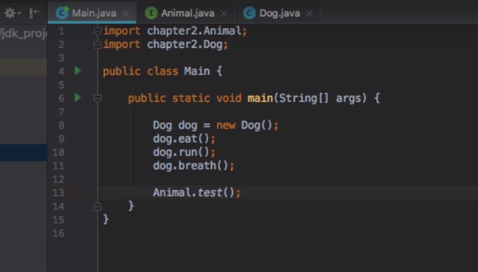

# 教程连接

### 视频选集

2/10

- [P11.2-Java新特性之JDK8相关开发环境准备](https://www.bilibili.com/video/av74138938/?p=1)
- [P22.1-Java新特性玩转JDK8之d](https://www.bilibili.com/video/av74138938/?p=2)
- [P32.2-Java新特性玩转JDK8之新增](https://www.bilibili.com/video/av74138938/?p=3)
- [P42.3-Java新特性玩转JDK8之时](https://www.bilibili.com/video/av74138938/?p=4)
- [P52.4-Java新特性玩转JDK8之时间日](https://www.bilibili.com/video/av74138938/?p=5)
- [P62.5- Java新特性玩转JDK8之Op](https://www.bilibili.com/video/av74138938/?p=6)
- [P73.1-Java高级核心玩转JDK8 Lambd](https://www.bilibili.com/video/av74138938/?p=7)
- [P83.2-Java新特性玩转JDK8之自定义函数](https://www.bilibili.com/video/av74138938/?p=8)
- [P94.1-Java新特性玩转JDK8之函数式编程](https://www.bilibili.com/video/av74138938/?p=9)
- [P10Java新特性玩转JDK8~13课程大纲讲解的副本](https://www.bilibili.com/video/av74138938/?p=10)

# 接口新特性

## Static与default 

[P22.1-Java新特性玩转JDK8之d](https://www.bilibili.com/video/av74138938/?p=2)

```java
public interface Animal(){
    void run();
    void eat();
    default void breath();		//实现Animal接口时，不用实现breath()就可以实列调用
    Static void test(){		//可以直接通过接口名调用
        System.out.println("测试");
    }
}
```



## 加解密API

### Base64 api 编码

[P32.2-Java新特性玩转JDK8之新增](https://www.bilibili.com/video/av74138938/?p=3)

```JAVA
public class Test {

	public static void main(String[] args) throws UnsupportedEncodingException {
		
	Encoder encoder = Base64.getEncoder();
	Decoder decoder = Base64.getDecoder();
	String text = "小弟课堂";
	byte[] textByte = text.getBytes("UTF-8");
	
	
	String encodeToString = encoder.encodeToString(textByte);
	System.out.println(encodeToString);
	byte[] b = {98,97,3,4,4,5,5,66,};
	System.out.println(new String(decoder.decode(encodeToString),"UTF-8"));
    //直接new String 对象的形式,并且指定转码格式
	System.out.println(new String(b,"UTF-8"));
	
	}
}
```

上面使用了私有构造属性的类 Encoder，所以上面没有new，因为构造方法私有化了，无法实列化，但是源码可见提供了外部可直接调用的静态方法，不用引包，编码效率高

要掌握JavaEE必须学会23种设计模式，才能理解框架

## 时间特性

 [P42.3-Java新特性玩转JDK8之时间特性](https://www.bilibili.com/video/av74138938/?p=4) 

