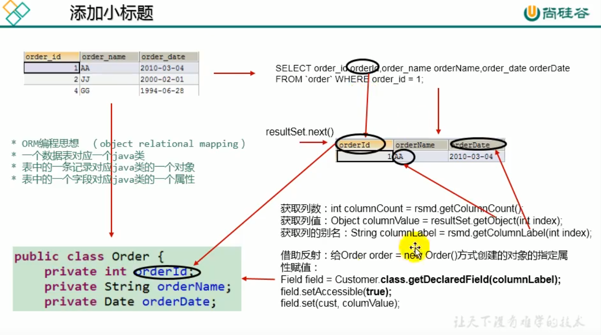

# Typora初级语法

## 目录

[toc]


## Typora快捷键

### 基本快捷键

- `Ctrl B`: **加粗**

- `Ctrl I`：*斜体*

- `Ctrl U`：<u>下划线</u>

- `shift alt 5`：~~删除线~~

- `shift ctrl ~`:行内代码

- `ctrl k`：[超连接](https://www.bilibili.com/video/av8819726?from=search&seid=3832455290610242926)

- `ctrl t`：表格

  | 标题 | 数据 | 大大大 |
  | ---- | ---- | ------ |
  | 打   |      |        |
  |      |      |        |
  |      |      |        |

- [](#视频选集):快速连接

  

### 视频选集

2/10

- [P11.2-Java新特性之JDK8相关开发环境准备](https://www.bilibili.com/video/av74138938/?p=1)
- [P22.1-Java新特性玩转JDK8之d](https://www.bilibili.com/video/av74138938/?p=2)
- [P32.2-Java新特性玩转JDK8之新增](https://www.bilibili.com/video/av74138938/?p=3)
- [P42.3-Java新特性玩转JDK8之时](https://www.bilibili.com/video/av74138938/?p=4)
- [P52.4-Java新特性玩转JDK8之时间日](https://www.bilibili.com/video/av74138938/?p=5)
- [P62.5- Java新特性玩转JDK8之Op](https://www.bilibili.com/video/av74138938/?p=6)
- [P73.1-Java高级核心玩转JDK8 Lambd](https://www.bilibili.com/video/av74138938/?p=7)
- [P83.2-Java新特性玩转JDK8之自定义函数](https://www.bilibili.com/video/av74138938/?p=8)
- [P94.1-Java新特性玩转JDK8之函数式编程](https://www.bilibili.com/video/av74138938/?p=9)
- 

### 自动表格

- [成分股涨幅排行](javascript:void(0))

|                      股票名称                      | 最新价 | 涨跌幅 |
| :------------------------------------------------: | :----: | :----: |
| [丰华股份](http://stockpage.10jqka.com.cn/600615/) | 10.29  | 10.05% |
| [浙江医药](http://stockpage.10jqka.com.cn/600216/) | 12.52  | 10.02% |
| [易见股份](http://stockpage.10jqka.com.cn/600093/) | 18.92  |  10%   |
| [华扬联众](http://stockpage.10jqka.com.cn/603825/) | 13.33  | 9.98%  |
| [新湖中宝](http://stockpage.10jqka.com.cn/600208/) |  4.66  | 9.91%  |
| [青岛海尔](http://stockpage.10jqka.com.cn/600690/) | 17.36  |  8.5%  |
|  [三棵树](http://stockpage.10jqka.com.cn/603737/)  | 80.15  | 7.96%  |
| [城地股份](http://stockpage.10jqka.com.cn/603887/) | 21.28  | 7.37%  |
| [上实发展](http://stockpage.10jqka.com.cn/600748/) |  6.81  | 7.24%  |
| [火炬电子](http://stockpage.10jqka.com.cn/603678/) | 22.18  | 6.69%  |

- `shift ctrl Q`:==引用==

> 我是世界上最帅的人
>
> ——尼古拉斯 · 赵四

- `ctrl shift I`：插入图片

- `ctrl shift M`：公式块：
  $$
  E= mC^2
  $$
  

  

  

  

  

### 不带快捷键的（需要Mark Down语法）

#### 代码块

`···`：三飘号+Enter

```java
package com.preparedstatement.crud;

public @interface test {

}


```

#### 无序、有序、任务列表

+ `+ 空格`：任务列表

  + `tab`：转换为下级列表

  1. 有序列表
  2. 有序列表

1. 有序列表

   1. 和和

   2. 

      

- [ ] `空格 + - + [ + 空格 + ]+空格`：任务列表
- [ ] 任务列表

#### 引用

`[^+数字]`：对应的引用指示采用同一书写格式

摘要：

本书从“知识”、“知识型”、“知识转型”等概念的界定讲起，考察了由古至今的知识类型和知识更迭，从纵横两方面进行了多视角的考察和研讨[^1]。

[^1]:石中英. 知识转型与教育改革[M]. 教育科学出版社, 2001.

#### 上标与下标

`shift+^+数字+^`: x^6^

`shift+~+数字+~`：H~2~O

#### 高亮、内联公式、高亮、注释、分割线

`==高亮对象==`：==高亮==

内联公式：$e^2$

$e^{w\pi}+1 = ShuaShauiDE$

<!--这一段显示不出来，在其他文档中-->

---


#### emoji图表

`：+相应信息`：:chart_with_upwards_trend:up图标

#### 目录生成

`[toc]`:

[toc]

#### [流程图绘制](https://blog.csdn.net/Subson/article/details/78054689)

内置 FLowChart、Sequence、Mermaid；流程图、时序图、甘特图引擎


```
1.流程图的定义仅由graph开始，但是方向的定义不止一种。

    1. TB（ top bottom）表示从上到下
    2. BT（bottom top）表示从下到上
    3. RL（right left）表示从右到左
    4. LR（left right）表示从左到右
    5. TD与TB一样表示从上到下

```


```
2.有以下几种节点和形状：

    默认节点 A
    文本节点 B[bname]
    圆角节点 C(cname)
    圆形节点 D((dname))
    非对称节点 E>ename]
    菱形节点 F{fname}
    以上大写字母表示节点，name表示它的名字，如下图。默认节点的A同时表示该节点和它的名字，例如上
    图的A和B。

```


​		

### 

